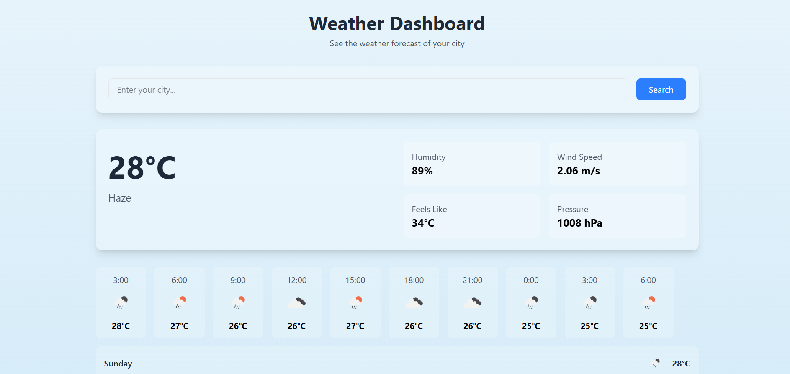

# 🌦️ Weather App based on City
A simple weather app that fetches and displays real time weather information for any city

## ✨ Features
Search weather by city name  
Show temperature, humidity, and weather condition  
Show hourly and daily weather information  
Responsive design for small device  

## Tech Stack
**Frontend**: React  
**API**: OpenWeatherAPI  
**Styling**: Tailwind  

## Installation & Usage
### Clone the repository
git clone https://github.com/rahman-tarek/weather-app

### Go inside the folder
cd weather-app

### Install dependencies
npm install   # or yarn install

### Start the app
npm start     # or yarn start

## API Setup
1. Get a free API key from OpenWeatherMap
2. Create a .env file in the project root and add:
    REACT_APP_WEATHER_API_KEY=your_api_key_here

## 📜 License
This project is licensed under the MIT License.